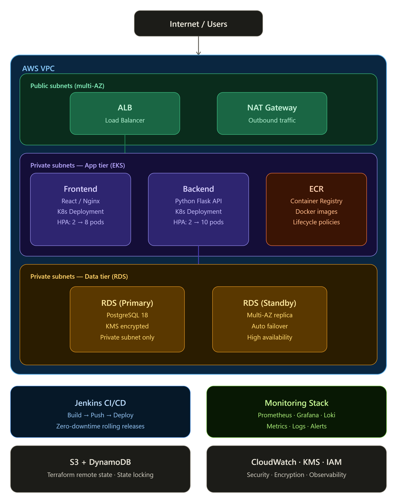
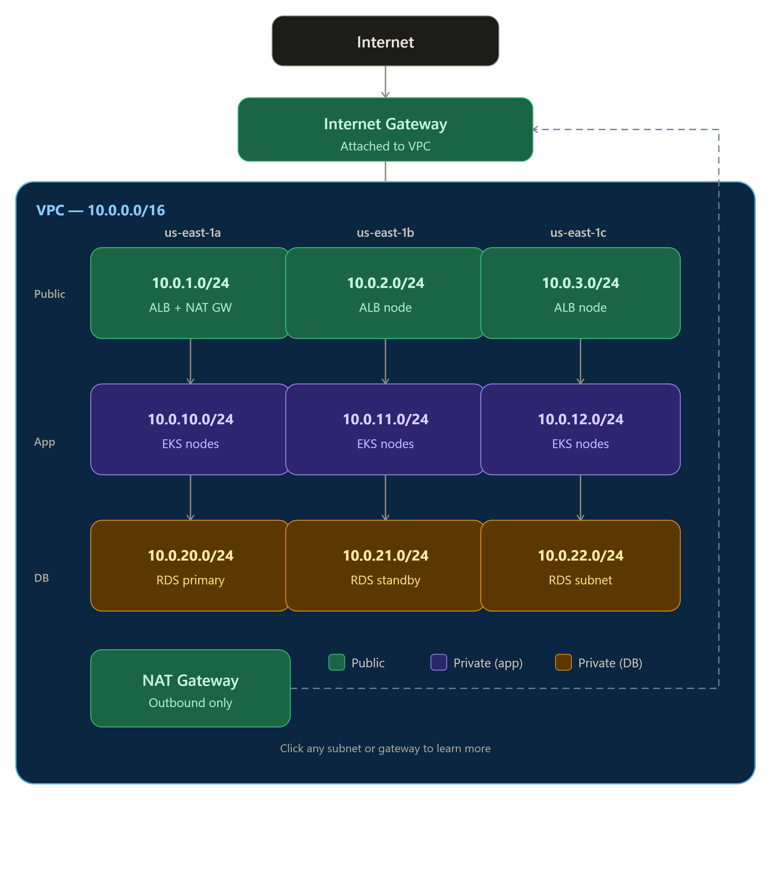

# Shopwise — Production-Grade DevOps Project

A complete end-to-end DevOps implementation of a 3-tier e-commerce application
on AWS, demonstrating enterprise-grade infrastructure, CI/CD, and observability.

## Architecture Overview



The application follows a 3-tier architecture:
- **Public tier**: ALB receives internet traffic and routes to EKS pods
- **App tier**: EKS runs frontend (React/Nginx) and backend (Python Flask) pods in private subnets
- **Data tier**: RDS PostgreSQL in isolated private subnets, unreachable from the internet

Supporting services: Jenkins for CI/CD, Prometheus/Grafana/Loki for observability,
S3+DynamoDB for Terraform state, KMS for encryption.

## VPC Network Design



A custom VPC (`10.0.0.0/16`) spans 3 Availability Zones with 9 subnets:

| Tier | AZ-a | AZ-b | AZ-c | Purpose |
|---|---|---|---|---|
| Public | 10.0.1.0/24 | 10.0.2.0/24 | 10.0.3.0/24 | ALB, NAT Gateway |
| Private App | 10.0.10.0/24 | 10.0.11.0/24 | 10.0.12.0/24 | EKS worker nodes |
| Private DB | 10.0.20.0/24 | 10.0.21.0/24 | 10.0.22.0/24 | RDS PostgreSQL |

Traffic flow: Internet → IGW → ALB (public) → EKS pods (private app) → RDS (private DB).
Private subnets use NAT Gateway for outbound-only internet access (image pulls, AWS APIs).

## Technology Stack

| Layer | Technology |
|---|---|
| Cloud | AWS (EKS, RDS, ECR, ALB, VPC, IAM, KMS, Secrets Manager) |
| IaC | Terraform (modular, multi-environment) |
| Containers | Docker (multi-stage builds) |
| Orchestration | Kubernetes (EKS 1.31) |
| CI/CD | Jenkins |
| Monitoring | Prometheus + Grafana + AlertManager |
| Logging | Loki + Promtail |
| Frontend | React + Vite + Nginx |
| Backend | Python Flask + SQLAlchemy |
| Database | PostgreSQL 18 (RDS) |

## Project Structure

shopwise/

├── applications/

│   ├── frontend/          # React + Vite + Nginx (multi-stage Docker)

│   └── backend/           # Python Flask API + SQLAlchemy

├── cicd/

│   ├── Jenkinsfile        # Build → Push → Deploy → Verify pipeline

│   └── scripts/           # ECR push, EKS deploy helpers

├── infrastructure/

│   └── terraform/

│       ├── environments/

│       │   ├── dev/       # Active deployment (t3.medium, single NAT GW)

│       │   ├── staging/   # Defined, not deployed

│       │   └── prod/      # Defined, not deployed

│       └── modules/

│           ├── vpc/       # VPC, subnets, IGW, NAT GW, route tables

│           ├── eks/       # EKS cluster, node group, OIDC, KMS

│           ├── rds/       # RDS PostgreSQL, parameter group, KMS

│           ├── iam/       # Cluster role, node role, IRSA, Jenkins role

│           ├── ecr/       # Container repositories, lifecycle policies

│           └── bastion/   # Jenkins EC2, security group, install script

├── kubernetes/

│   ├── base/

│   │   ├── backend/       # Deployment, Service, HPA, ConfigMap, Secret

│   │   ├── frontend/      # Deployment, Service, HPA, ConfigMap

│   │   ├── ingress/       # ALB Ingress with path-based routing

│   │   └── network-policies.yaml

│   └── monitoring/

│       ├── alertmanager/  # PrometheusRule for shopwise alerts

│       └── grafana/       # Dashboard ConfigMap

└── docs/

├── architecture/      # Architecture diagrams

├── adr/               # Architecture Decision Records

## Quick Start

### Prerequisites

```bash
aws --version        # AWS CLI configured with admin access
terraform --version  # >= 1.0
kubectl version      # >= 1.28
helm version         # >= 3.0
docker --version     # >= 24.0
```

### Deploy Dev Environment

```bash
# Clone the repository
git clone https://github.com/rohitdabare15/shopwise.git
cd shopwise

# Deploy all infrastructure (~20 minutes)
cd infrastructure/terraform/environments/dev
terraform init
terraform apply

# Configure kubectl
aws eks update-kubeconfig --region us-east-1 --name shopwise-dev

# Deploy application and monitoring
bash infrastructure/scripts/rebuild-dev.sh
```

### Access the Application

```bash
# Get the ALB URL
kubectl get ingress shopwise-ingress -n shopwise \
  -o jsonpath='{.status.loadBalancer.ingress[0].hostname}'

# Access Grafana (keep this terminal open)
kubectl port-forward -n monitoring \
  svc/kube-prometheus-stack-grafana 3000:80
# Open http://localhost:3000 (admin / shopwise-admin-2024)
```

### Destroy Dev Environment

```bash
# Run at end of every session to stop AWS charges (~$0.29/hr)
bash infrastructure/scripts/destroy-dev.sh
```

## Key Features Demonstrated

### Infrastructure as Code
- Modular Terraform — each AWS service is an independently reusable module
- Multi-environment support — same modules serve dev/staging/prod via different tfvars
- Remote state in S3 with DynamoDB locking — safe for team use
- 3 environments defined, dev deployed — demonstrates enterprise patterns on a budget

### Security
- IAM least-privilege — separate roles for EKS control plane, nodes, pods, Jenkins
- IRSA — pods get AWS credentials via OIDC, no static keys
- Network policies — default-deny with explicit allow rules per service
- Non-root containers — backend (uid 1000), frontend/nginx (uid 101)
- KMS encryption — EKS etcd secrets and RDS storage both encrypted at rest
- Secrets Manager — database credentials never in code or state files

### CI/CD
- Jenkins pipeline with parallel image builds
- Automatic ECR push with build-number and latest tags
- Rolling deployment with zero downtime (maxSurge=1, maxUnavailable=0)
- Health check verification after every deploy
- Git-triggered builds via SCM polling

### Observability
- Prometheus — cluster and application metrics with 7-day retention
- Grafana — pre-built K8s dashboards + shopwise namespace dashboard
- AlertManager — alerts for pod crashes, high CPU, not-ready pods
- Loki + Promtail — centralised log aggregation from all pods

### Auto Scaling
- HPA — backend scales 2→10 pods on CPU >70% or memory >80%
- HPA — frontend scales 2→8 pods on CPU >70%
- Cluster Autoscaler — nodes scale 1→3 based on pending pod pressure

## Infrastructure Cost (Dev Environment)

| Resource | Spec | $/hr | $/day (8hrs) |
|---|---|---|---|
| EKS Control Plane | Managed | $0.100 | $0.80 |
| EC2 Worker Nodes | 2× t3.medium | $0.083 | $0.66 |
| RDS | db.t3.micro, PostgreSQL 18 | $0.017 | $0.14 |
| NAT Gateway | 1× (dev optimisation) | $0.045 | $0.36 |
| Jenkins EC2 | t3.medium | $0.041 | $0.33 |
| **Total** | | **$0.286/hr** | **$2.29/day** |

> **Cost tip:** Run `bash infrastructure/scripts/destroy-dev.sh` at end of each session.
> Rebuilding takes ~20 minutes with `rebuild-dev.sh`.

## Architecture Decisions

| Decision | Choice | Reason |
|---|---|---|
| Orchestration | EKS over ECS | Cloud-agnostic, IRSA, industry standard |
| IaC | Terraform over CloudFormation | Multi-cloud portability, modular |
| State | S3 + DynamoDB | Team-safe, versioned, locked |
| CI/CD | Jenkins over GitHub Actions | Enterprise commonality, self-hosted |
| Database | RDS over self-managed | Managed backups, patching, failover |
| Registry | ECR over Docker Hub | IAM auth, same-region pulls, no rate limits |
| Secrets | Secrets Manager over K8s Secrets | Rotation, audit trail, CSI integration |

See [docs/adr/](docs/adr/) for full Architecture Decision Records.

## Author

**Rohit Dabare**
[GitHub](https://github.com/rohitdabare15) | [LinkedIn](https://linkedin.com/in/rohitdabare)

